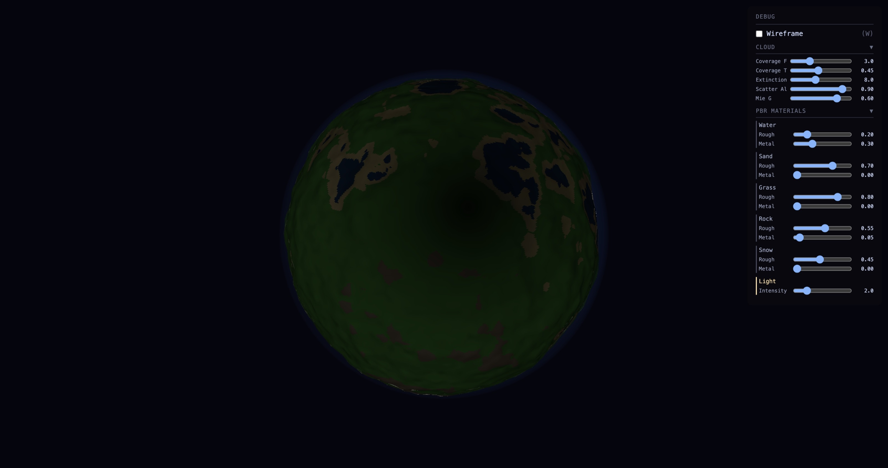

# 八面体法线接缝问题：球面中心出现暗环

## 问题现象

在某些摄像机角度下，球面朝向摄像机的一侧中央区域会出现一圈较暗的环形，该暗环随视角拖动而移动（跟随球面而非跟随屏幕）。



如截图所示：受光侧清晰可见地表特征，但受光区域内存在一圈相对较暗的区域，在拖动视角时该区域随球体一起移动，说明这是球面上的一个固定特征，而非屏幕空间的 artifact。

---

## 根本原因：八面体展开的接缝处中心差分越界

### 法线计算流程

`normal_gen.wgsl` 采用中心差分法从高度缓冲区计算法线：对每个 texel `(i, j)`，分别向 i 和 j 方向各取一个前后邻居，得到两个切线向量，再取 cross product 得到法线。

```wgsl
let p_left  = displaced_position(i_left,  j, d);   // i−1
let p_right = displaced_position(i_right, j, d);   // i+1
let p_down  = displaced_position(i, j_down,  d);   // j−1
let p_up    = displaced_position(i, j_up,    d);   // j+1

let n = normalize(cross(p_right - p_left, p_up - p_down));
```

### 八面体展开的内部接缝

`oct_decode` 将 2D UV 坐标解码为球面方向，内部使用两套不同公式：

```wgsl
fn oct_decode(uv: vec2<f32>) -> vec3<f32> {
  let p = uv * 2.0 - 1.0;
  let z = 1.0 - abs(p.x) - abs(p.y);
  if (z >= 0.0) {
    n = vec3(p.x, p.y, z);           // 上半球（z ≥ 0）公式
  } else {
    n = vec3(...折叠公式...);         // 下半球（z < 0）公式
  }
}
```

两套公式的**分界线**就是满足 `|p.x| + |p.y| = 1`（即 `z = 0`）的对角线。在 UV 空间中，这是穿过 UV 正方形中央的四条对角线；在球面上，对应四段弧线，合称八面体的"z = 0 赤道接缝"。

虽然 `oct_decode` 本身在该边界处是连续的（两套公式在 z = 0 时给出相同结果），但其**梯度（一阶导数）在边界两侧并不相同**——两套展开公式的求导结果在接缝处发生突变。

### 接缝处中心差分产生错误切线向量

当某个 texel 位于接缝附近，其 i 方向的两个邻居（`p_right` 和 `p_left`）分别落在接缝两侧时，两点之间的差分并不是该点真正的切线方向，而是跨越了不同展开面的"错误差量"。

以接缝中点（p.x = p.y = 0.5，球面点 ≈ (0.707, 0.707, 0)）为例，数值分析可得：

- 实际 cross product 结果：**(-0.707, -0.707, 0)**（指向球心，内法线）
- 正确的外法线应为：**(0.707, 0.707, 0)**

法线方向完全翻转，导致接缝附近的地表在 NdotL 计算时得到负值，被 `max(..., 0)` 夹断为 0，仅剩环境光贡献，整体呈现为暗带。

### 为什么暗环恰好在球面中央

初始摄像机位置为 `theta = π/3, phi = 0`，坐标约为 `(3.46, 2.0, 0)`，即摄像机**恰好在球体的 z = 0 平面内**。

球面上朝向摄像机的点（视线与球面法线最对齐的位置）就是 `n = (0.866, 0.5, 0)`，满足 `n.z = 0`，正好落在八面体接缝上。

因此：

- 球面上的接缝弧线（z = 0 方向的若干弧段）在此摄像机角度下从屏幕看来环绕着球面正中心
- 接缝处的错误法线产生暗带
- 暗带跟随球面旋转移动，而非锁定在屏幕空间

---

## 修复方案

在将 cross product 结果写入缓冲区之前，用球面该点的出发方向（即无位移时的球面法线 `sphereDir`）做 dot product 检验：若计算所得法线与球面出法线方向相反（dot < 0），则取反。

```wgsl
let sphereDir = oct_decode(uv_at(i, j));
let n_raw     = cross(p_right - p_left, p_up - p_down);
// 接缝处 cross product 可能给出内法线；确保始终与球面出法线同向。
let n = normalize(select(-n_raw, n_raw, dot(n_raw, sphereDir) >= 0.0));
```

### 为什么这个修复是安全的

- **接缝以外**：cross product 给出正确的外法线，`dot(n_raw, sphereDir) > 0`，`select` 不触发，行为不变。
- **接缝处**：cross product 翻转为内法线，`dot < 0`，`select` 取 `-n_raw`，恢复为正确的外法线方向。
- 该检验不会影响地形坡面法线的倾斜方向，只纠正整体朝向的翻转。

### 修改文件

`src/shaders/normal_gen.wgsl`，`main` 函数结尾处（法线写入前）。

---

## 附：为什么不直接交换 cross product 参数

直接将 `cross(A, B)` 改为 `cross(B, A)` 等效于对**所有** texel 的法线取反。由于当前代码在接缝以外的区域使用 `cross(∂P/∂V, ∂P/∂U)` 恰好给出 WebGPU 左手坐标系下的外法线，全局取反反而会破坏非接缝区域的正确法线。dot product 检验只在确实翻转的地方介入，是更精确的修复。
